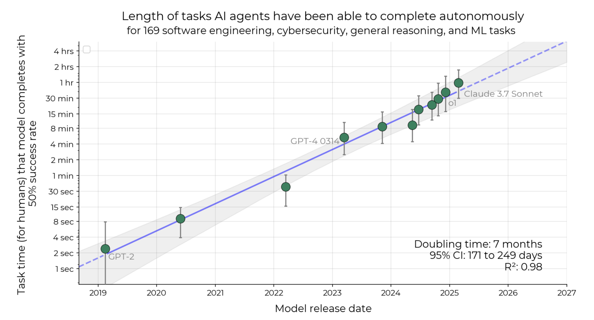
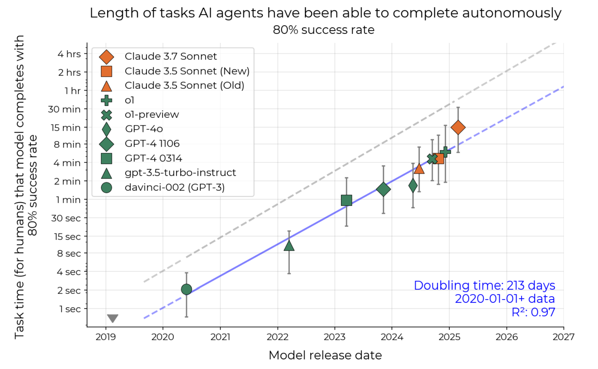
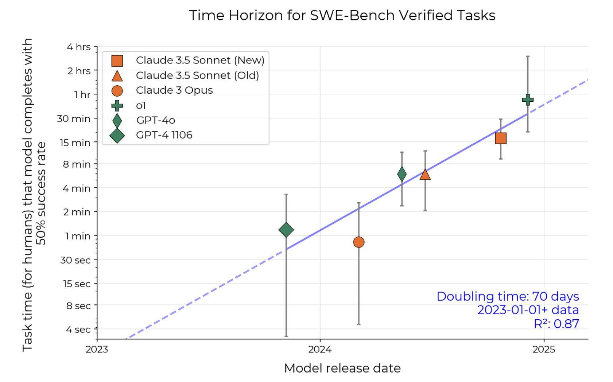
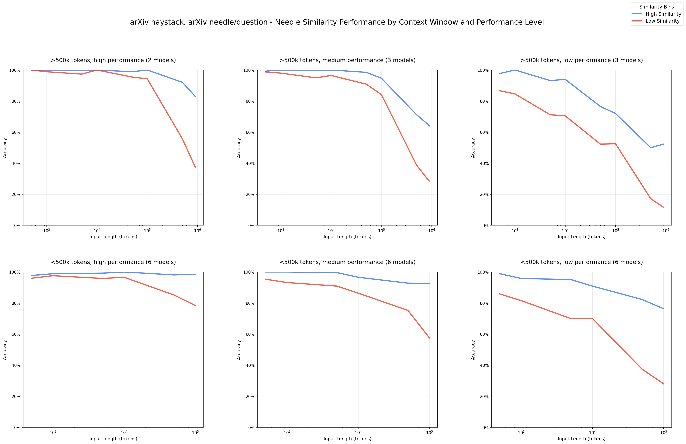

## Agentic Coding in 2025

#### Jiri Klic

###### Full Stack GenAI Engineer

<div class="qr-code-small">


</div>

---

### LLMs, Chains and Agents


|||
### Coding Agents as VS Code extensions

* GitHub Copilot
* Cline
* Roo Code
* Kilo Code

|||
### Coding Agents as IDE

###### (Mostly forks of VS Code)

* Cursor
* Windsurf
* AWS Kiro
* Gogle Antigravity


|||
### Coding Agents in CLI

* Claude Code
* Gemini CLI
* DeepAgents CLI
* Cline CLI

---

### Lenght of tasks AI can do




<div class="extra-small">
    <a href="https://metr.org/blog/2025-03-19-measuring-ai-ability-to-complete-long-tasks/">METR (19 March 2025) Measuring AI Ability to Complete Long Tasks</a>
</div>

<small>
    
</small>

|||
### Agents 80%



|||
### SWE 50%



---

### Model Context

|||
### Context Rot and Poisoning
<div class="two-column">
    <div>
        
        <div class="extra-small">
            <a href="https://research.trychroma.com/context-rot">Chroma (July 14, 2025) Cotext rot report</a>
            <br/>
            <a href="https://www.youtube.com/watch?v=TUjQuC4ugak">Chroma (July 14, 2025) YouTube video</a>
        </div>
    </div>
    <div>
        <div class="extra-small">
            <div class="quote-block" style="margin-top: 1.2rem;">
                <i>
                "Context Poisoning is when a hallucination
                or other error makes it into the context,
                where it is repeatedly referenced."
                </i>
            </div>
            <div class="spaced-links">
                <a href="https://www.dbreunig.com/2025/06/22/how-contexts-fail-and-how-to-fix-them.html">Drew Breunig (June 22, 2025) How Long Contexts Fail</a>
                <br/>
                <br/>
                <a href="https://arxiv.org/abs/2507.06261">Google DeepMind (July 7, 2025) Gemini 2.5: Pushing the Frontier with Advanced Reasoning, Multimodality, Long Context, and Next Generation Agentic Capabilities</a>
                <br/>
                <br/>
                <a href="https://neuraltrust.ai/blog/echo-chamber-context-poisoning-jailbreak">NeuralTrust (June 23, 2025) Echo Chamber: A Context-Poisoning Jailbreak That Bypasses LLM Guardrails</a>
                <br/>
                <br/>
                <a href="https://www.anthropic.com/research/small-samples-poison">Anthropic (October 9, 2025) A small number of samples can poison LLMs of any size</a>
            </div>
        </div>
    </div>
</div>


|||
### Prompt Injection


|||
### Context Engineering

* Culling
* Compacting
* Sub-Agents
* Memory and RAG
* Multi session planning and execution
* Spec-driven development

---

### Spec-driven development

|||
### BMAD


|||
### GitHub Spec-Kit


|||
### OpenSpec


---

### Model Context Protocol


|||
### Python Exmaple


```python
import os

print("Hello World!")
```

|||
### JS Example


|||
### RAG-MCP


|||
### MCP as Files


---


### Claude Code


|||
### System Prompt


|||
### Tools


|||
### Hooks


|||
### Agents


---


### Gemini CLI


|||
### Google Search


|||
### Using Gemini as Claude Code Sub-Agents


---

### Claude Agent SDK


|||
### Sub-Agents


---

### Agentic frameworks

* LangGraph
* AWS Strands
* Crew AI

|||
### LLM Observability

* MLflow LLM tacing
* Phoenix
* OpenTelemetry

|||
### LLM Evaluation


---

### Thank You

 


